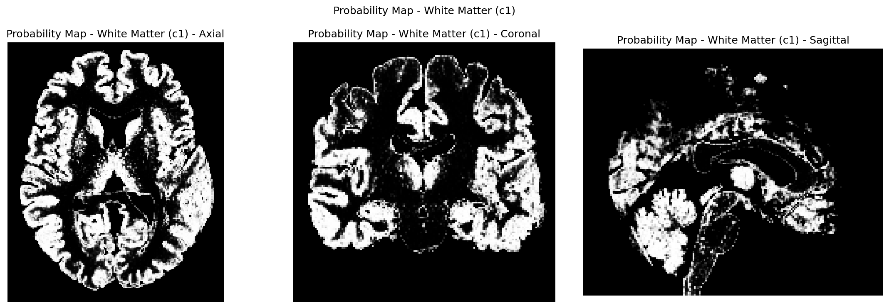
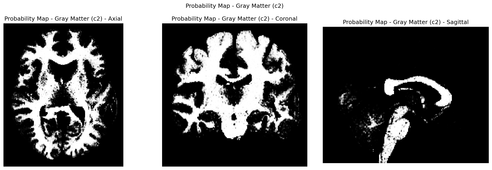
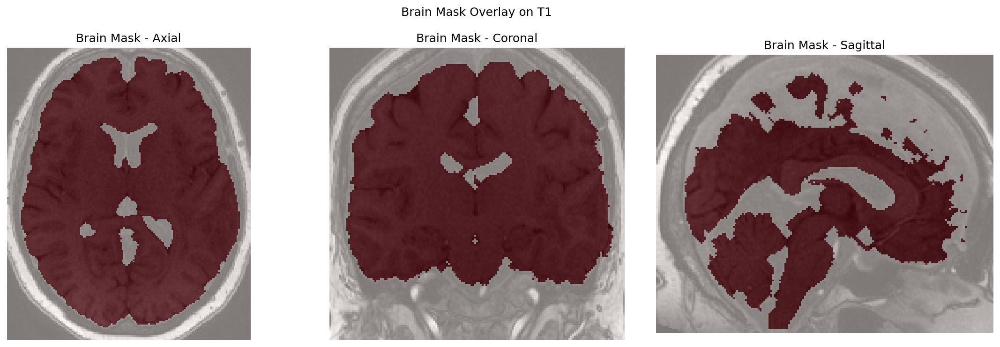
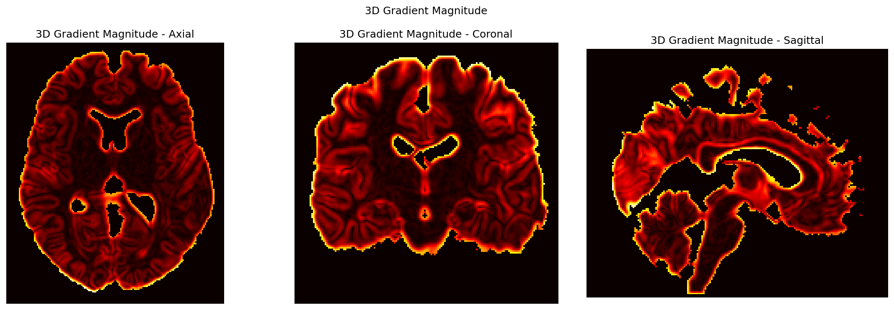
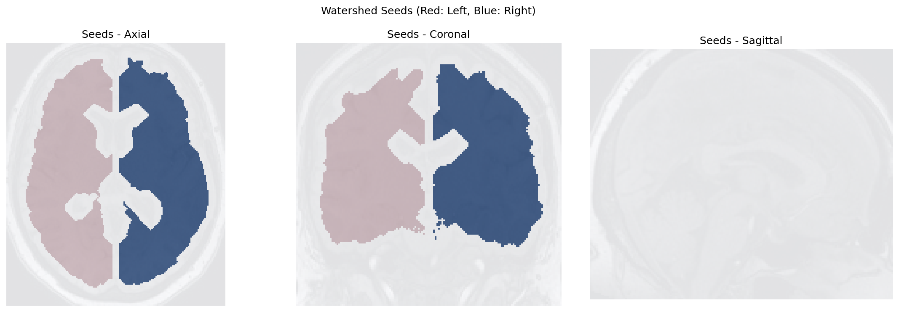
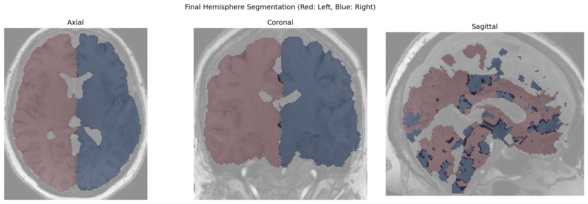

# Brain Hemisphere Segmentation

A Python-based neuroimaging tool for automatic segmentation of brain hemispheres from T1-weighted MRI scans using 3D watershed algorithm.

## Overview

This project implements a robust pipeline for separating left and right brain hemispheres from T1-weighted MRI data. The algorithm uses tissue probability maps (white matter and gray matter) to create a brain mask, estimates the midline, and applies a 3D watershed segmentation to generate distinct hemisphere masks.

## Algorithm Workflow

### Step 1: Input Images
**File: `segmentation_results/01_t1_original.png`**

- **Original T1-weighted MRI**: The base anatomical image used for segmentation
- Shows axial, coronal, and sagittal views of the input T1 scan

### Step 2: Tissue Probability Maps
**File: `segmentation_results/02_c1_white_matter.png`**

- **White Matter Probability Map (c1)**: Binary mask showing white matter tissue probabilities

**File: `segmentation_results/03_c2_gray_matter.png`**

- **Gray Matter Probability Map (c2)**: Binary mask showing gray matter tissue probabilities

### Step 3: Brain Mask Creation
**File: `segmentation_results/04_brain_mask.png`**

- **Brain Mask Overlay**: Composite image showing the extracted brain region
- Red overlay indicates the final brain mask region

### Step 4: 3D Gradient Calculation
**File: `segmentation_results/05_gradient_magnitude.png`**

- **3D Gradient Magnitude**: Computed from the smoothed intracranial volume
- Essential for watershed algorithm to identify natural separation boundaries

### Step 5: Watershed Seeds
**File: `segmentation_results/06_watershed_seeds.png`**

- **Watershed Seed Points**: Initial markers for hemisphere separation
- **Red**: Left hemisphere seed region
- **Blue**: Right hemisphere seed region

### Step 6: Final Segmentation
**File: `segmentation_results/07_final_hemispheres.png`**

- **Final Hemisphere Segmentation**: Results of 3D watershed algorithm
- **Red**: Left hemisphere mask
- **Blue**: Right hemisphere mask

## Technical Details

### Dependencies
- Python 3.7+
- nibabel
- numpy
- scipy
- scikit-image
- matplotlib

### Usage
```python
# Set your file paths
path = r"your_data_directory"
t1_name = "your_t1_image.nii"
c1_name = "c1_white_matter.nii"
c2_name = "c2_gray_matter.nii"

### Author
**Dr. Pamela Franco**  
Email: pamela.franco@unab.cl / pafranco@uc.cl